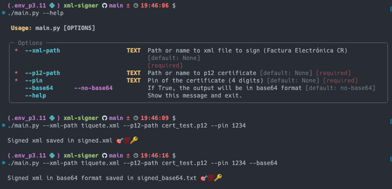

# XML Signer
Author: @Izcarmt95

This is a simple XML Signer made in Python 3.11 using the library lxml.
Valid for Electronic Invoice Costa Rica. Version 4.X +

## Prerequisites
- Python 3.11

## Installation
- Clone this repository
- Create a virtual environment
    ```
    python3.11 -m venv .env_p3.11
    ```
- Activate the virtual environment
    ```
    source .env_p3.11/bin/activate
    ```
- Install the requirements
    ```
    pip install -r requirements.txt
    ```
- Run the script and follow the instructions
    ```
    $ ./main.py --help
                                                                                                                 
    Usage: main.py [OPTIONS]                                                                                    
                                                                                                                
    ╭─ Options ─────────────────────────────────────────────────────────────────────────────────────────────────╮
    │ *  --xml-path                   TEXT  Path or name to xml file to sign (Factura Electrónica CR)           │
    │                                       [default: None]                                                     │
    │                                       [required]                                                          │
    │ *  --p12-path                   TEXT  Path or name to p12 certificate [default: None] [required]          │
    │ *  --pin                        TEXT  Pin of the certificate (4 digits) [default: None] [required]        │
    │    --base64      --no-base64          If True, the output will be in base64 format [default: no-base64]   │
    │    --help                             Show this message and exit.                                         │
    ╰───────────────────────────────────────────────────────────────────────────────────────────────────────────╯
    ```
## Example
- **xml file and cert file must be in the same directory where the script is executed**


